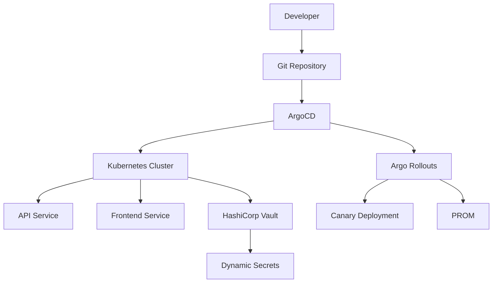

# GitOps Platform — ArgoCD on Kubernetes

Production-oriented GitOps platform implementing continuous
reconciliation, progressive delivery, secrets management,
and automated drift remediation on Kubernetes.

This project demonstrates GitOps principles by managing
application deployments entirely through Git while using
ArgoCD to continuously reconcile cluster state against the
declared source of truth.

The platform eliminates manual deployment workflows,
reduces configuration drift, and enables auditable,
repeatable, and safe application delivery.

---

## Overview

Modern Kubernetes platforms require more than deployment
automation.

They require:

* Declarative deployments
* Continuous reconciliation
* Automated drift detection
* Progressive delivery
* Centralized secrets management
* Auditable change history

This platform uses ArgoCD as the GitOps control plane,
ensuring the cluster continuously matches the desired
state stored in Git.

---

## Architecture



---

## Problem Statement

Traditional Kubernetes deployments often rely on manual
kubectl commands and imperative operational workflows.

This introduces several risks:

* Configuration drift
* Limited deployment traceability
* Inconsistent environments
* Difficult rollback procedures
* Increased operational overhead
* Secret sprawl

GitOps addresses these challenges by making Git the
single source of truth for platform state.

With ArgoCD:

* Every deployment is version controlled
* Every change is reviewed before release
* Drift is detected automatically
* Rollbacks become predictable
* Cluster state remains continuously reconciled

---

## Architecture Components

| Component       | Purpose                 |
| --------------- | ----------------------- |
| ArgoCD          | GitOps Control Plane    |
| Argo Rollouts   | Progressive Delivery    |
| Kubernetes      | Container Orchestration |
| Prometheus      | Metrics Collection      |
| Grafana         | Visualization           |
| Alertmanager    | Alert Routing           |
| HashiCorp Vault | Secrets Management      |
| GitHub Actions  | CI Pipeline             |
| GHCR            | Container Registry      |

---

## Deployment Workflow

1. Developer updates application manifest.
2. Pull Request is reviewed and merged.
3. ArgoCD detects repository change.
4. Cluster synchronizes automatically.
5. Argo Rollouts begins canary deployment.
6. Prometheus validates deployment health.
7. Traffic is promoted or rollback occurs automatically.

---

## Repository Structure

```text
gitops-argocd-platform/
├── apps/
│   ├── staging/
│   └── production/
├── argocd/
│   ├── install/
│   ├── applications/
│   └── appsets/
├── rollouts/
│   ├── canary-rollout.yaml
│   └── bluegreen-rollout.yaml
├── monitoring/
│   ├── alerts/
└── terraform/
    └── argocd-install/
```

---

## Environments

| Environment | Sync Policy     | Delivery Strategy |
| ----------- | --------------- | ----------------- |
| Staging     | Automatic       | Direct Deployment |
| Production  | Manual Approval | Canary Deployment |

---

## Progressive Delivery

Argo Rollouts manages controlled application promotion.

Features include:

* Canary deployments
* Automated rollback
* Traffic splitting
* Metric-based promotion
* SLO validation through Prometheus

Unlike native Kubernetes Deployments, promotion decisions
can be driven directly from application health metrics.

---

## Drift Detection

ArgoCD continuously compares live cluster state against
Git state.

Any manual modification introduced through kubectl is:

* Detected automatically
* Marked OutOfSync
* Reconciled back to Git state

This prevents unauthorized or accidental configuration drift.

---

## Secrets Management

HashiCorp Vault provides:

* Dynamic credentials
* Secret rotation
* Lease management
* Audit logging
* Centralized governance

Note: Kubernetes Secrets are Base64 encoded and should
not be considered a complete secrets-management solution.

---

## Failure Scenarios

| Scenario                    | Expected Response          |
| --------------------------- | -------------------------- |
| Manual cluster modification | ArgoCD auto-reconciliation |
| Failed image deployment     | Rollout halted             |
| Canary SLO breach           | Automatic rollback         |
| Application sync failure    | Prometheus alert generated |
| Secret expiration           | Vault re-issues credential |

---

## Technical Decisions

### Why ArgoCD?

ArgoCD provides continuous reconciliation, ApplicationSets,
multi-environment management, and strong visibility into
cluster drift status.

### Why Argo Rollouts?

Native Deployments cannot perform metric-driven promotion.
Argo Rollouts enables canary analysis and automated rollback.

### Why GitOps?

Git becomes the authoritative source of truth, improving
auditability, repeatability, and deployment consistency.

### Why Vault?

Dynamic secrets eliminate long-lived credentials and reduce
the operational risk associated with static secret storage.

---

## Verification

```bash
# Check application status
argocd app list

# Verify sync status
argocd app get frontend

# Verify rollouts
kubectl get rollouts -A

# Verify cluster workloads
kubectl get pods -A
```

---

## Results

Successful deployment provides:

* Continuous GitOps reconciliation
* Automated drift remediation
* Canary deployment capability
* Prometheus-driven rollout validation
* Dynamic secrets management through Vault
* Multi-environment deployment support

---

## Lessons Learned

* GitOps significantly reduces operational drift
* Progressive delivery improves deployment safety
* Secret management must be designed early
* Monitoring should be treated as a platform dependency
* ApplicationSets simplify multi-environment management

---

## Future Improvements

* Multi-cluster GitOps management
* Policy enforcement with Kyverno
* Service mesh integration
* Disaster recovery automation
* High availability ArgoCD deployment
* Automated compliance validation

---

> Git is not a deployment trigger.
> Git is the desired state of the platform.

---

## Author

Olamide Olalekan — Platform & DevSecOps Engineer

LinkedIn: https://linkedin.com/in/olamide-olalekan-12138a265

GitHub: https://github.com/velrite

Website: https://velrite.github.io

---

## Related Projects

* Auto-Healing Kubernetes Platform
* Terraform Kubernetes Platform
* Dockerize Everything
